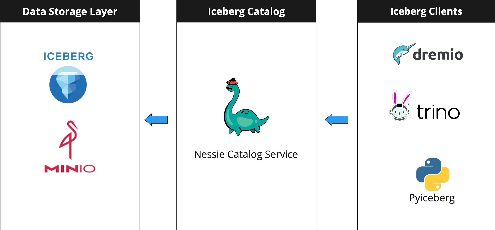

# Apache Iceberg Practice

This project is my learning record of Apache Iceberg. Build a demo data lakehouse based on iceberg and query these iceberg tables with iceberg-supported clients.

## Architecture
Below picture is the data lakehouse project service architecture. Use minio as object storage system and iceberg as open table format.
Use Nessie, a open source iceberg catalog server as a single access point for multiple iceberg clients. 


## Iceberg Clients
This project use 3 iceberg clients like below.
1. [Trino](https://trino.io/)
2. [Dremio](https://www.dremio.com/)
3. [Pyiceberg](https://py.iceberg.apache.org/)

## How to start
1. Start related docker images.
```bash
$ docker-compose up
```
2. Prepare related python enviroment
```bash
# Need poetry as python package management tool first
$ poetry install
```
3. Download these sample csv files below and place them into `data` folder.

https://www.kaggle.com/datasets/mayurgadekar5555/industrial-equipment-maintenance-data/data


4. Run Jupyter notebook
* `load_data_iceberg.ipynb`
* `trino_iceberg.ipynb`

## Reference
1. https://www.dremio.com/blog/intro-to-dremio-nessie-and-apache-iceberg-on-your-laptop/#h-setting-up-dremionessieminio
2. https://github.com/wirelessr/trino-iceberg-playground
3. https://py.iceberg.apache.org/api/
4. https://projectnessie.org/guides/iceberg-rest/
5. https://www.dremio.com/blog/intro-to-pyiceberg/
6. https://projectnessie.org/iceberg/trino/

