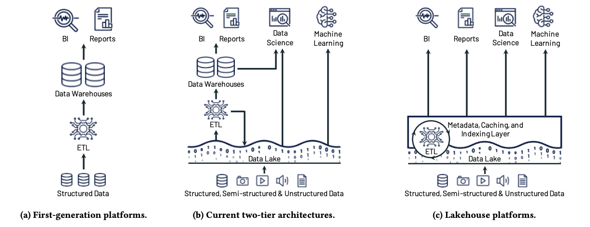
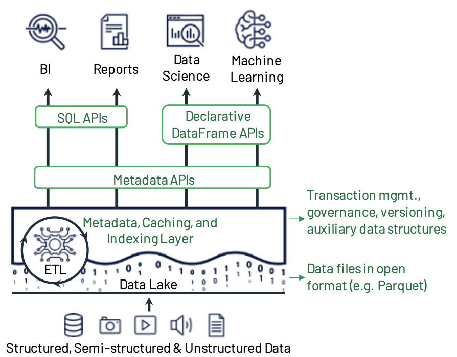
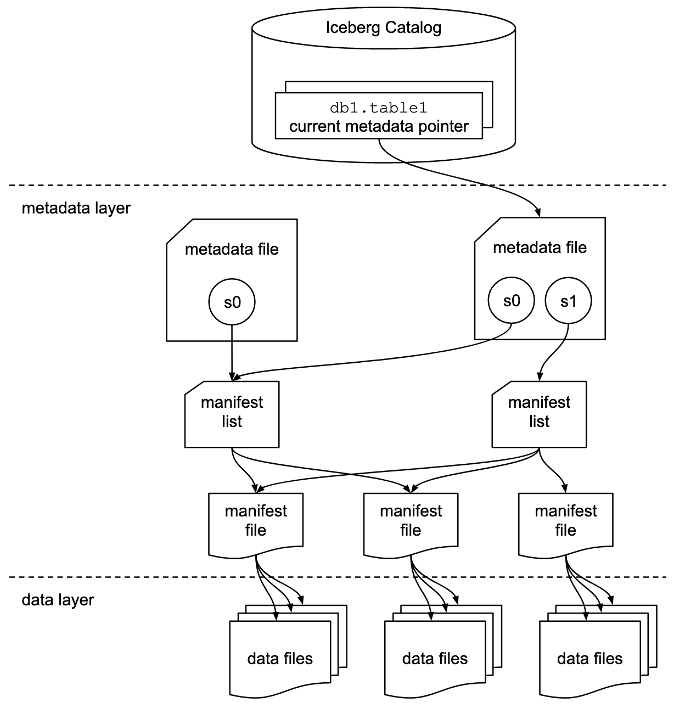
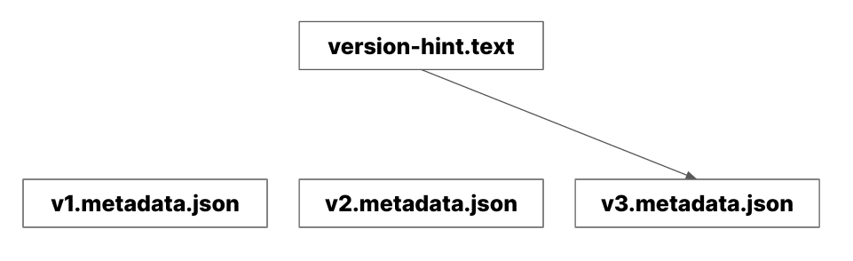
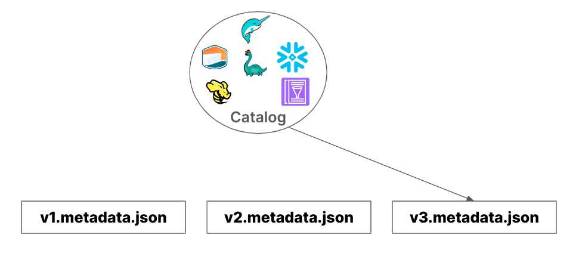

# Data lakehosue-Iceberg survey

## Data LakeHouse

Data LakeHouse is a new data platform architecture that combines DBMS characteristics with Data Lake[1], allowing objects in object storage to be treated as logical tables, supporting SQL query read/write and ACID transaction operations. Its purpose is to reduce the traditional costs of building downstream ETL pipelines to copy data into databases, enabling BI dashboards to access data directly from the raw data layer.

The key characteristic that enables Data LakeHouse to function this way is that it adds a Metadata Catalog layer on top of traditional Data Lake storage formats (ex: Parquet) to manage operations similar to traditional DBMS and provide additional data access functionality.

## Apache Iceberg

Data LakeHouse has dedicated open table formats for implementation, and Apache Iceberg is one of them, originally developed by Netflix, supporting features like time travel, dynamic schema evolution, and Partition Evolution. Compared to other formats (ex: Apache Hudi, Delta lake), Apache Iceberg appears to be becoming the industry's unified data format standard[2].

As shown in the diagram below, an Iceberg table is controlled by the Iceberg catalog service which manages related metadata and ACID operations. This metadata contains important information such as schema, partition, snapshot, and physical data locations, while the data layer stores the actual data.

The Iceberg catalog is crucial for Iceberg, serving as its control center. Its main task is to track changes to Iceberg tables. Every time an Iceberg table is updated, a new `metadata.json` file is generated, and the Iceberg catalog maintains a pointer to the latest `metadata.json`.

When a query engine queries an Iceberg table, the first step is always to retrieve metadata information from the Iceberg catalog.

Iceberg catalogs can be divided into two types:

1. file based catalog
    
    The most basic default Hadoop catalog uses `version-hint.text` stored in object storage to track the latest metadata. It is generally not recommended for use in production environments due to data consistency issues.
    
    
    
2. service based catalog
    
    Uses a dedicated external service to manage metadata, providing complete metadata tracking and synchronization capabilities.
    
    
    

## Reference

1.  [https://www.cidrdb.org/cidr2021/papers/cidr2021_paper17.pdf](https://www.cidrdb.org/cidr2021/papers/cidr2021_paper17.pdf)
2. [https://www.theregister.com/2024/10/14/apache_iceberg_feature_announcements/](https://www.theregister.com/2024/10/14/apache_iceberg_feature_announcements/)